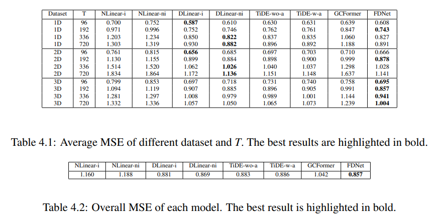
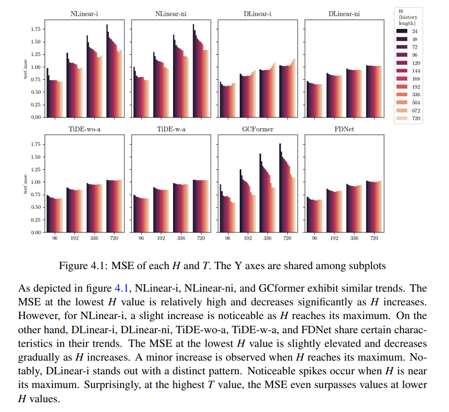

# Comparative Analysis of Deep Learning Models for Long-term Time Series Prediction in Marine Turbine Variables

This dissertation investigates long-term time series prediction for turbine variables, including velocity, torque, and thrust. The robust long-term predictions offer benefits for turbine
adjustments and better engine management. The distinctive traits of Turbine Marine datasets
have been examined. Through a comparison of diverse methods from various deep learning
model families based on mean squared error, this study evaluates their effectiveness regarding prediction accuracy and model complexity. The standout model, FDNet, shows remarkable predictive capabilities, while the more lightweight model, DLinear, also performs well.
This analysis guides the researchers and practitioners in selecting models to suit their work,
not only in turbine experiments but also in other similar time series prediction problems. The
code is available at https://github.com/Nackalalalong/turbine2023.

The dissertation file is available [here](https://github.com/Nackalalalong/turbine2023/blob/main/dissertation.pdf)

# Result

